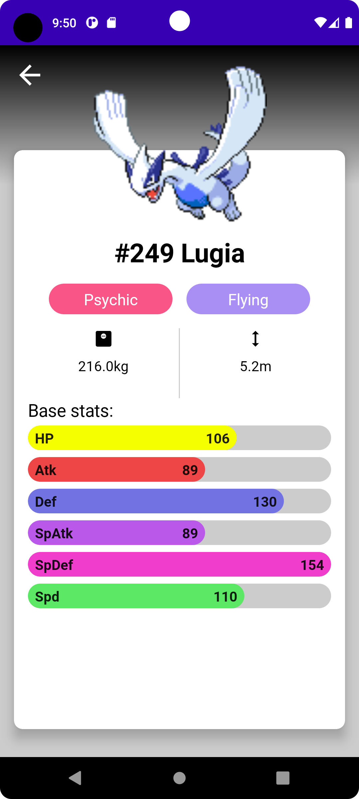

# Proof Of Concept Conférence 2022-2023
### Théo DELBARRE M2 Informatique ILI

## Lancer le projet

Avant de pouvoir lancer le projet, vous devez cloner celui-ci dans le répértoire de votre choix.

Pour lancer le projet, plusieurs choix s'offrent à vous :

- Ouvrez le projet dans AndroidStudio après avoir vérifié que celui-ci est à jour. Lancez l'application dans l'émulateur avec le raccourci maj+F10 et en cliquant sur le bouton run en haut a droite du menu.

- Ouvrez le projet dans AndroidStudio après avoir vérifier que celui-ci est à jour. Connectez votre smartphone Android via USB et vérifiez que celui-ci est reconnu par votre AndroidStudio. Lancez l'application sur votre smartphone avec le raccourci maj+F10 et en cliquant sur le bouton run en haut à droite du menu.

Dans le cas où vous n'arriveriez pas à lancer le projet, une courte vidéo de démonstration est disponible sous ce lien : [Vidéo Démo](https://youtube.com/shorts/7y-duN1G-cU?feature=share)

## JetPack Compose

Android JetPack est la bibliothèque utilisée en développement android natif pour gérer les interfaces utilisateur en respectant les bonnes pratiques mobile.

JetPack Compose est une nouvelle version de JetPack qui est recommandée aujourd'hui par Google pour les applications Android. La grande différence avec les anciennes versions de JetPack c'est qu'avant on éditait les vues android avec des fichiers xml. Avec Compose, on décrit nos vues directement avec du code en allant bien plus vite et en ayant un meilleur controle sur le comportement et les apparences des vues.

Les principales différences entre Jetpack et Jetpack Compose sont les suivantes :

- Jetpack est une suite d'outils qui couvre plusieurs aspects du développement Android, tandis que Jetpack Compose est spécifiquement destiné à la création d'interfaces utilisateur.

- Jetpack utilise des bibliothèques traditionnelles pour la création d'interfaces utilisateur, comme XML et Android Views, tandis que Jetpack Compose utilise une approche plus moderne et déclarative basée sur Kotlin.

- Jetpack Compose offre une plus grande flexibilité et une plus grande rapidité de développement pour la création d'interfaces utilisateur, tandis que Jetpack est plus axé sur la fourniture de solutions prêtes à l'emploi pour les problèmes courants de développement.

## Description générale du projet

Ce projet est basé sur un tutoriel JetPack Compose que j'ai pu suivre pendant l'année afin de m'auto former à cette technologie.
Bien entendu, il y a un nombre significatif de différences entre le tutoriel et ce projet. Notamment l'utilisation de bibliotheques bien plus à jour et la mise à niveau de celles utilisées auparavant.

Il s'agit d'un pokédex, outil issu de Pokémon afin de lister l'ensemble des pokémons ainsi que leurs caractéristiques. Celui-ci récupère depuis l'api [pokeapi](https://pokeapi.co/) l'ensemble des informations ainsi que les images des différents pokémons.

Vous avez accès à une liste déroulante contenant plusieurs centaines de pokémons et au clic sur l'un d'entre eux, vous arrivez sur une vue montrant le nom, l'identifiant ainsi que les caractéristiques du pokémon.

## Point technique

#### Architecture 

Ce projet utilise l'architecture [MVVM](https://developer.android.com/topic/libraries/architecture/viewmodel?hl=fr). Il s'agit de l'architecture privilégiée par Google pour le développement d'applications Android. Le viewModel est le fichier qui gère l'ensemble de l'intelligence d'un Screen.

#### Screen

Chaque vue en Compose est appelée un Screen. C'est dans celle-ci que sont déclarés nos différents Composables qui forment la vue. Ils remplacent totalement les anciennes vues en XML utilisées autrefois dans le développement Android.

#### Navigation

La navigation qui était anciennement gérée avec un [NavGraph](https://developer.android.com/guide/navigation/navigation-getting-started) propre à Android est ici gérée avec un [navController](https://developer.android.com/jetpack/compose/navigation?hl=fr) spécifique à Compose qui se rapproche des routes utilisées dans les langages de développement front.

#### Les injections Hilt

J'utilise ici le [hiltViewmodel](https://developer.android.com/training/dependency-injection/hilt-jetpack?hl=fr) qui permet  d'injecter les différents viewModels sans passer par la création de ViewmodelProvider. Cela simplifie l'initialisation de ceux-ci et l'appel des viewModels dans les Screen.

Cette bibliothèque à subie de nombreux changements au cours de cette année et aura posé quelques problèmes au niveau de l'implémentation sur ce projet. 

#### Chargement d'images depuis une API : Coil

Afin de charger les différentes images depuis l'API, on ne peut pas utiliser le composant Image natif à Android, il faut utiliser une bibliothèque externe. Pour cela, différents choix s'offrent à nous :

- [Picasso](https://square.github.io/picasso/) est une très ancienne bibliothèque dans l'univers Android. C'est la première que j'ai utilisé sur ce projet. Cepandent, après discussion avec d'autres développeurs, j'ai essayé d'autres bibliothèques.

- [Glide](https://github.com/bumptech/glide) est la seconde bibliothèque que j'ai essayé. Celle-ci fonctionnait très bien mais, Google a entre-temps poussé une autre bibliothèque pour le chargement d'images en Android.

- [Coil](https://coil-kt.github.io/coil/) est la bibliothèque poussée par Google actuellement. Je suis finalement parti sur celle-ci pour ce projet.

## Vue du projet

